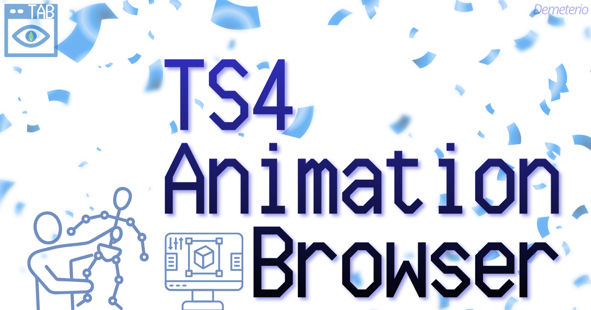
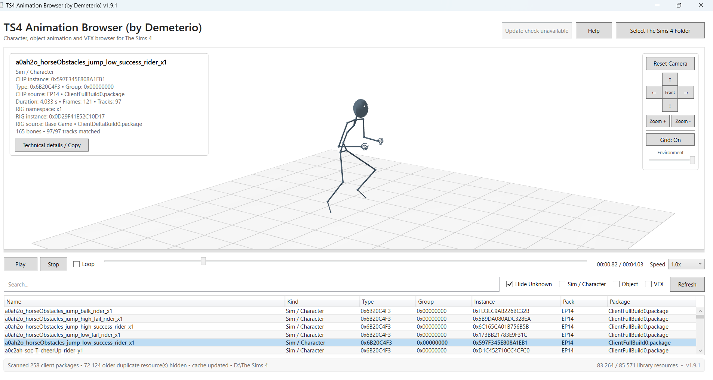
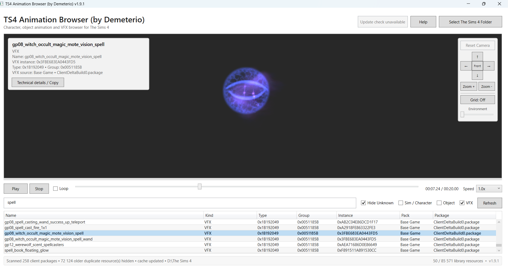
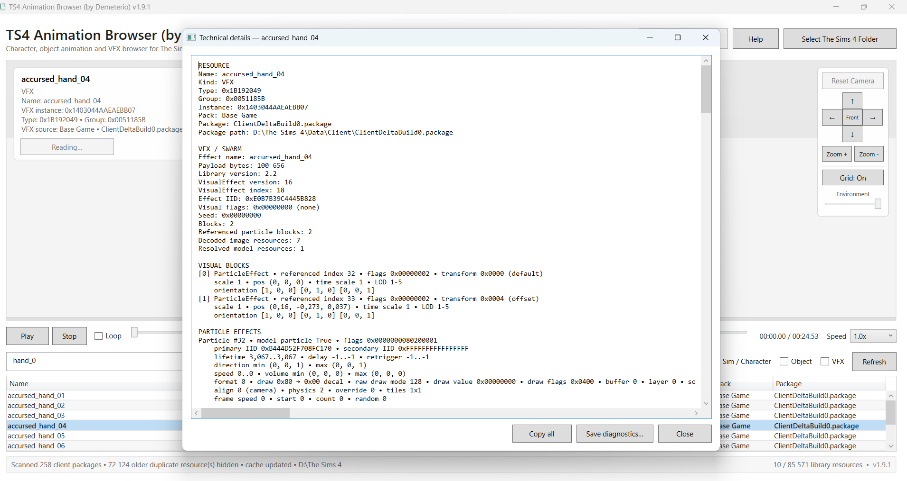

# Demeterio's TS4 Animation Browser

TS4 Animation Browser is a Windows desktop utility created by Demeterio for browsing, inspecting and previewing animation and VFX resources from a local installation of **The Sims 4**.

The project is currently under development. Animation browsing is already usable, while VFX rendering remains experimental and will continue to improve over future releases.

## Screenshots

  
  

  

## Features

* Scan animation and VFX resources from an installed copy of The Sims 4
* Search resources by name, type, group, instance, pack or package
* Filter Sim / Character animations, Object animations and VFX
* Preview character and object animations with decoded rigs
* Inspect VFX and particle effects
* Experimental Direct3D 11 VFX and Model Particle rendering
* Playback timeline, looping and playback speed controls
* Orbit, pan, zoom and front-facing camera controls
* Selectable resource information
* Copy or save detailed technical diagnostics
* Local encrypted library cache for faster startup
* Automatic check for newer published releases

## Requirements

* **Windows 11 x64 recommended**
* Windows 10 x64 may work as a best-effort legacy configuration
* A local installation of The Sims 4
* A Direct3D 11 capable graphics environment

The official self-contained release is intended to include its required .NET runtime, so users should not need to install the .NET Desktop Runtime separately.

## Installation

1. Download the latest release ZIP.
2. Extract the complete archive to a writable folder.
3. Do not run the application directly from inside the ZIP.
4. Start the application executable.
5. Click **Select The Sims 4 Folder**.
6. Select the main installation folder for The Sims 4.
7. Allow the initial library scan to complete.

Nothing needs to be installed in your Sims 4 `Mods` folder.

## Library Cache

After a successful scan, TS4 Animation Browser creates:

`TS4AnimationBrowser.dtab`

The file is stored next to the application and allows the indexed resource library to be restored more quickly on later launches.

The cache is compressed and protected using Windows DPAPI for the current Windows user.

It can safely be deleted. The browser will simply rebuild it after the next game scan.

The application reads game resources from your local The Sims 4 installation. It does **not** upload the indexed game library or the `.dtab` cache.

## Update Check

At startup, TS4 Animation Browser makes a small HTTPS request to the public Demeterio GitHub Releases endpoint to check whether a newer published version is available.

The application does **not** automatically download or install updates.

If a newer version is available, the update button can open the public release page in your default web browser.

An Internet connection is not required for normal resource browsing.

## VFX Preview

VFX support is still experimental.

TS4 Animation Browser can decode and preview a growing range of sprite particles, textures, models and materials, but the renderer does not yet reproduce every behaviour of The Sims 4 graphics engine.

Known limitations include:

* Some Model Particle emission and spawning behaviour is approximated
* Some particle physics and alignment modes are incomplete
* Some specialised shaders are not fully reproduced
* Transparency and certain material effects may differ from the game
* Some model vertex formats and normals remain under active development
* Unsupported resources may display technical diagnostics instead of a complete preview

These limitations do not affect the original game files.

## Links

**Tumblr:**
https://demeterio.tumblr.com/

**GitHub:**
https://github.com/Demeterio

**Releases:**
https://github.com/Demeterio/TS4-Animation-Browser/releases

## Disclaimer

TS4 Animation Browser is an independent, unofficial fan-made modding utility.

It is not affiliated with, endorsed by, sponsored by, or supported by Electronic Arts Inc. or Maxis.

The Sims, The Sims 4, EA, Maxis, and related names, trademarks, game assets and intellectual property belong to their respective owners.

Third-party libraries, technologies, trademarks and intellectual property remain the property of their respective authors and owners.

The application is intended to inspect resources from a user's own local installation of The Sims 4. No ownership is claimed over Electronic Arts, Maxis or third-party intellectual property.

## Copyright

Copyright © 2026 Demeterio.

The TS4 Animation Browser application code, original interface work and original documentation are protected by their applicable rights.

Electronic Arts, Maxis and third-party intellectual property remain the property of their respective owners.
